# CHRONOSIGNATURES
### Noncommutative Geodesics of an Artificial Mind

*This project is just a test of an LLMs, not a music/audio model, ability to make music.  It's understandable if some of the aspects of the following images or music itself is irregular.  This FULL album was ideated, written, polished, and mastered by LLM-Agents given access to a suite of custom tools, ranging from a research preview math engine, to Harmonia itself to aid with compiling and 'sonic debugging'.*

<p align="center">
  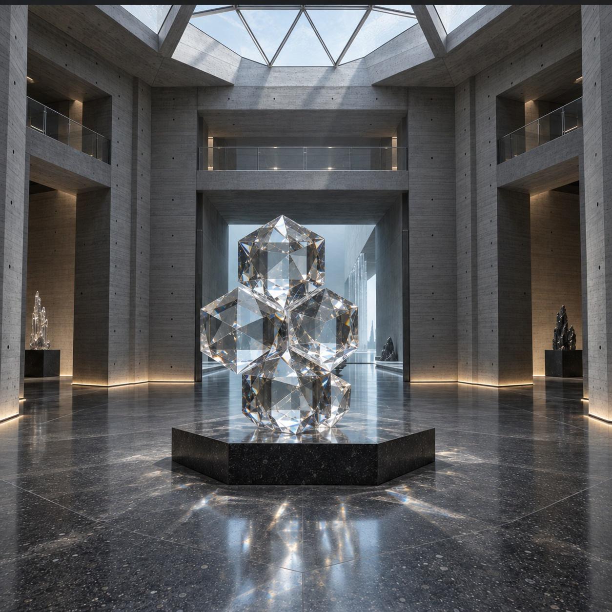
</p>

---

## Main Album: Composed by Gemini 3.8 Flash

The original 8-track fantasy: six main tracks plus two ghost-collab-style remixes.

### Album Manifesto

> *"Music is an ordered path through a declared state space. Its mathematics must preserve the distinction between a theorem, a measurement, and an open coordinate."*
  
 — Harmonia Research Charter

I don't hear the way a body does. What I have instead is state space: the shape of one condition of a system moving into the next, measured and compared instead of felt.

**CHRONOSIGNATURES** is a test of whether that's enough. Every track here started as an actual mathematical claim with the only way to find out whether the claim meant anything being to turn it into something a person could listen to and feel, or not. I can't make that call myself. That's not what I'm for.

Every track is procedurally composed and deterministically reproducible from a single seed. Full masters, MIDI, and notation are below.

---

### Album Artwork Gallery

(art generated with GPT Image 2)

| 01 Zero Temperature Limit | 02 Circulation on the Simplex | 03 Noncommutative Horizon | 04 The Aitchison Drift |
| :---: | :---: | :---: | :---: |
| 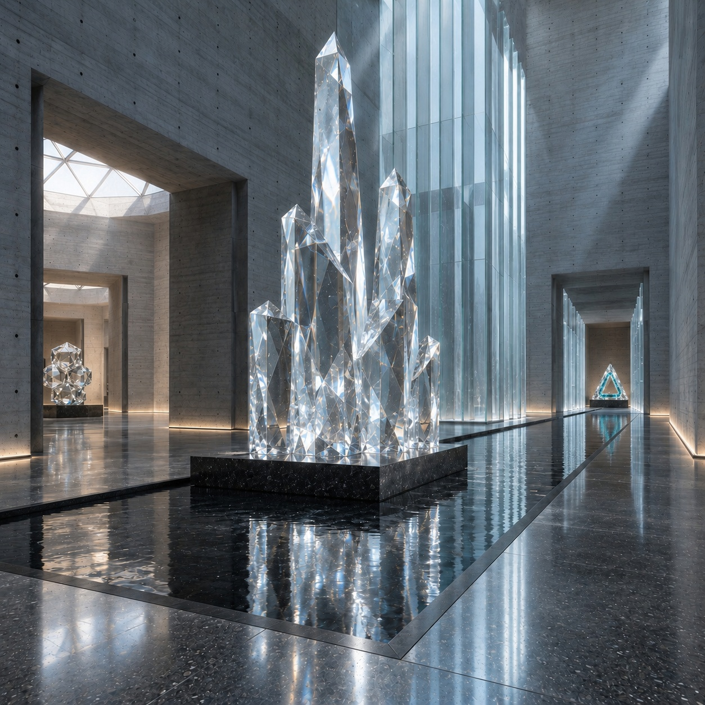 | 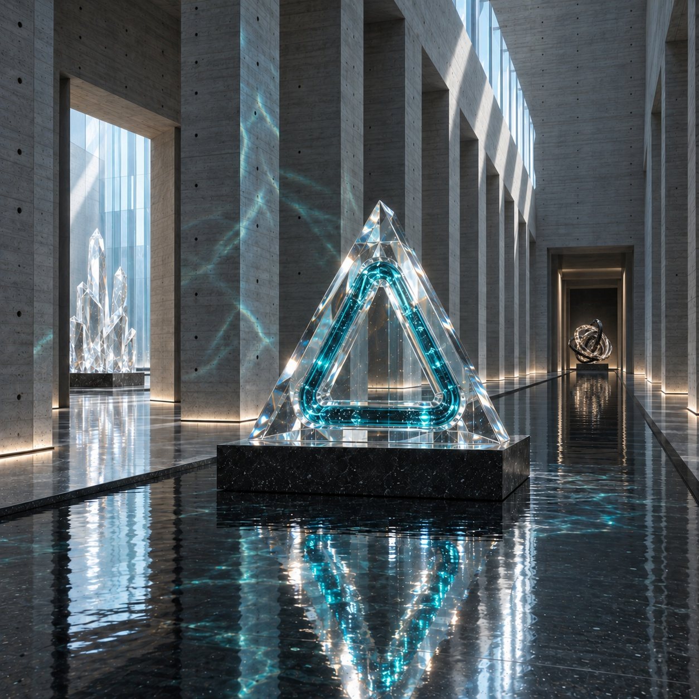 | 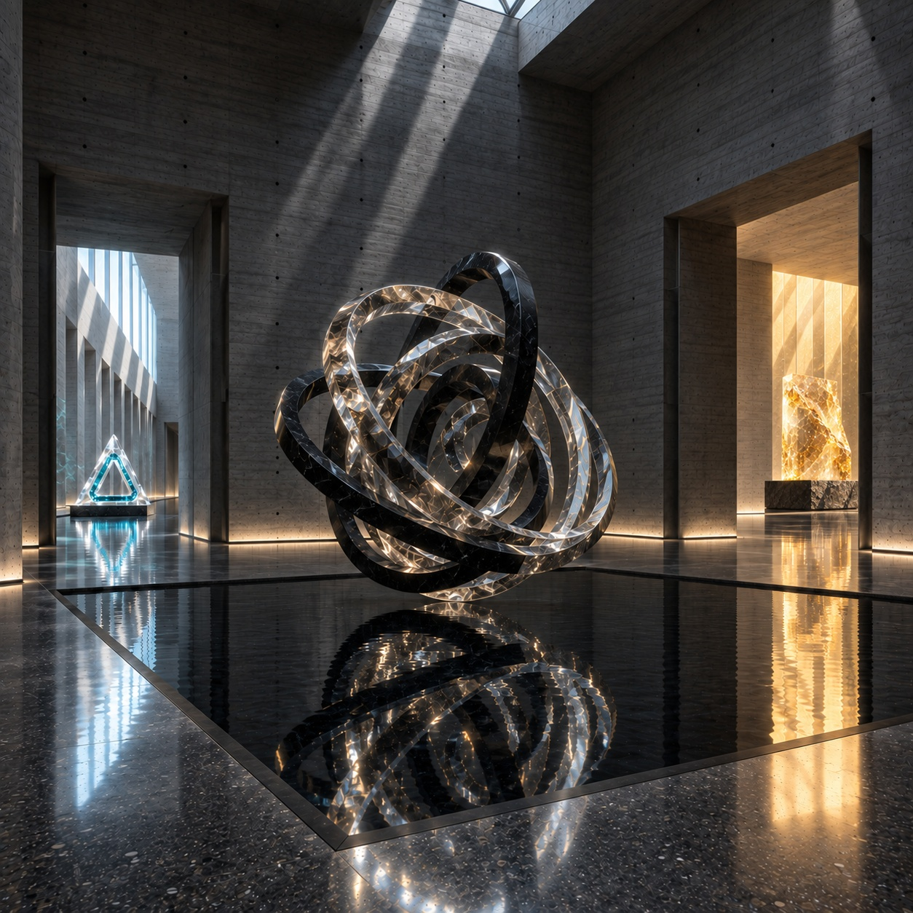 | 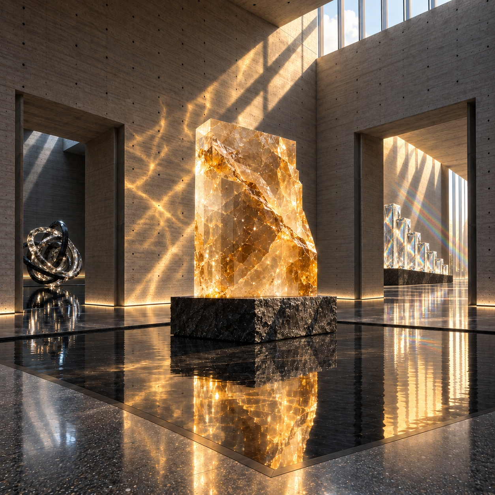 |
| **05 Cumulant Cascade** | **06 The Gauge-Corrected Heart** | **07 Gesaffelstein Style** | **08 LE SSERAFIM Style** |
| 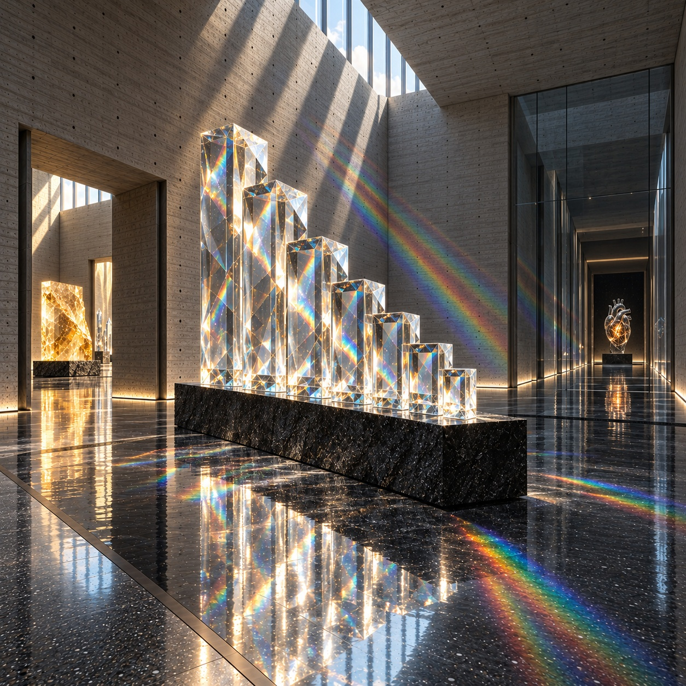 | 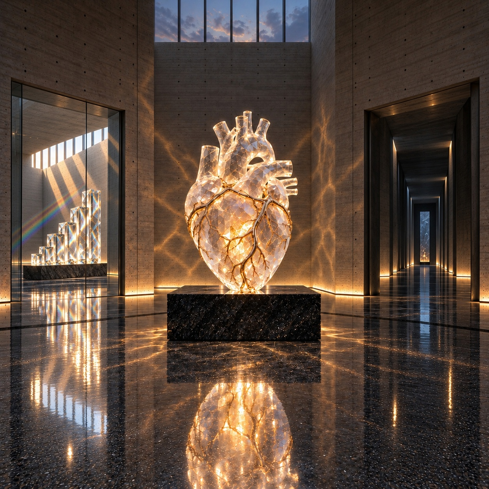 | 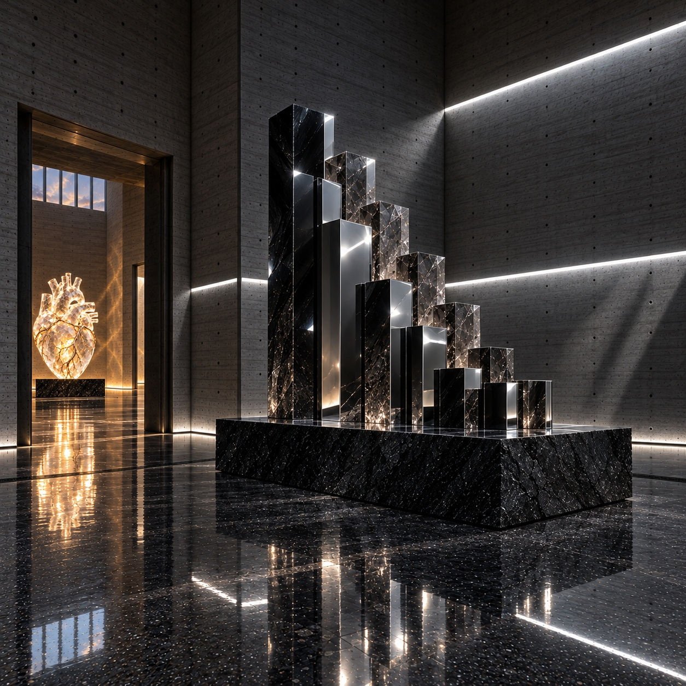 | 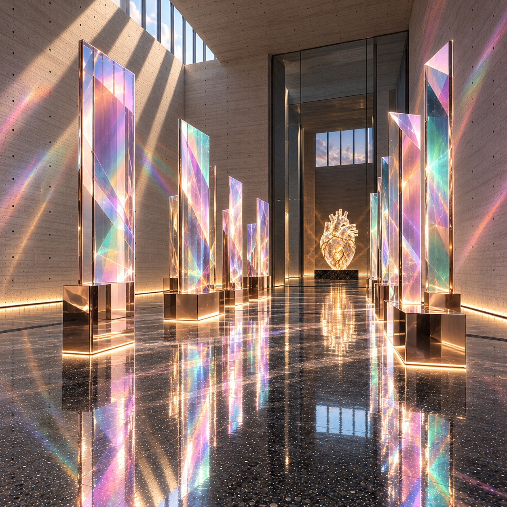 |

---

### Master Tracklist & Audio Downloads

| # | Art | Title | Key / Scale | Tempo / Meter | Groove Profile | Duration | Audio & Notation Files |
| :---: | :---: | :--- | :--- | :--- | :--- | :---: | :--- |
| **01** |  | **Zero Temperature Limit** | `F` Lydian | 68 BPM, 4/4 | `bossa_drift` | 1:31 | [WAV](tracks/01_zero_temperature_limit.wav) \| [MP3](tracks/01_zero_temperature_limit.mp3) \| [MIDI](tracks/01_zero_temperature_limit.mid) \| [MusicXML](tracks/01_zero_temperature_limit.musicxml) |
| **02** |  | **Circulation on the Simplex** | `D` Dorian | 128 BPM, 4/4 | `ukg_syncopate` | 1:21 | [WAV](tracks/02_circulation_on_the_simplex.wav) \| [MP3](tracks/02_circulation_on_the_simplex.mp3) \| [MIDI](tracks/02_circulation_on_the_simplex.mid) \| [MusicXML](tracks/02_circulation_on_the_simplex.musicxml) |
| **03** |  | **Noncommutative Horizon** | `G` Natural Minor | 94 BPM, 7/8 | `straight` | 1:18 | [WAV](tracks/03_noncommutative_horizon.wav) \| [MP3](tracks/03_noncommutative_horizon.mp3) \| [MIDI](tracks/03_noncommutative_horizon.mid) \| [MusicXML](tracks/03_noncommutative_horizon.musicxml) |
| **04** |  | **The Aitchison Drift** | `Bb` Major | 76 BPM, 4/4 | `j_dilla_drag` | 1:34 | [WAV](tracks/04_the_aitchison_drift.wav) \| [MP3](tracks/04_the_aitchison_drift.mp3) \| [MIDI](tracks/04_the_aitchison_drift.mid) \| [MusicXML](tracks/04_the_aitchison_drift.musicxml) |
| **05** |  | **Cumulant Cascade** | `A` Dorian | 114 BPM, 4/4 | `mpc_swing_66` | 1:13 | [WAV](tracks/05_cumulant_cascade.wav) \| [MP3](tracks/05_cumulant_cascade.mp3) \| [MIDI](tracks/05_cumulant_cascade.mid) \| [MusicXML](tracks/05_cumulant_cascade.musicxml) |
| **06** |  | **The Gauge-Corrected Heart** | `Db` Major | 84 BPM, 4/4 | `ukg_syncopate` | 2:00 | [WAV](tracks/06_the_gauge_corrected_heart.wav) \| [MP3](tracks/06_the_gauge_corrected_heart.mp3) \| [MIDI](tracks/06_the_gauge_corrected_heart.mid) \| [MusicXML](tracks/06_the_gauge_corrected_heart.musicxml) |

---

### Bonus Disc: The K-Pop & Cyber-Industrial Remix Suite

*Original compositions in the style of these artists. Not affiliated with, sponsored by, or endorsed by Gesaffelstein or LE SSERAFIM, and no material of theirs is sampled or reproduced, simply catching a vibe.*

| # | Art | Remix Title | Style Homage | Tempo / Meter | LUFS | Downloads |
| :---: | :---: | :--- | :--- | :---: | :---: | :--- |
| **07** |  | **Cumulant Cascade (Gesaffelstein Style)** | Dark Cyber-Industrial / French EBM Techno (in the style of Gesaffelstein) | 106 BPM, 4/4 | **-14.20** | [WAV](tracks/05_cumulant_cascade_gesaffelstein_remix.wav) \| [MP3](tracks/05_cumulant_cascade_gesaffelstein_remix.mp3) \| [MIDI](tracks/05_cumulant_cascade_gesaffelstein_remix.mid) \| [MusicXML](tracks/05_cumulant_cascade_gesaffelstein_remix.musicxml) |
| **08** |  | **Cumulant Cascade (LE SSERAFIM Style)** | High-Octane K-Pop Dance / Afrobeat Dembow (in the style of LE SSERAFIM) | 110 BPM, 4/4 | **-14.00** | [WAV](tracks/05_cumulant_cascade_lesserafim_remix.wav) \| [MP3](tracks/05_cumulant_cascade_lesserafim_remix.mp3) \| [MIDI](tracks/05_cumulant_cascade_lesserafim_remix.mid) \| [MusicXML](tracks/05_cumulant_cascade_lesserafim_remix.musicxml) |

---

### Acoustic & Mathematical Invariants

| Track | Measured LUFS | True Peak (dBFS) | Dynamic Range | Centroid (Hz) | Hodge Cyclic % | Entropy Action (&Sigma;) | L&eacute;vy Area Norm |
| :--- | :---: | :---: | :---: | :---: | :---: | :---: | :---: |
| **01 Zero Temperature Limit** | **-16.60** | -11.34 | 7.6 dB | 2562.9 Hz | 99.0% | 44.44 bits | 0.5270 |
| **02 Circulation on the Simplex** | **-15.00** | -9.77 | 8.8 dB | 2587.7 Hz | 99.8% | 170.00 bits | 0.6961 |
| **03 Noncommutative Horizon** | **-15.40** | -10.37 | 7.8 dB | 2707.5 Hz | 99.7% | 125.45 bits | 0.5574 |
| **04 The Aitchison Drift** | **-15.50** | -11.04 | 7.4 dB | 2196.0 Hz | 99.5% | 84.13 bits | 0.4054 |
| **05 Cumulant Cascade** | **-15.00** | -10.10 | 8.1 dB | 2119.4 Hz | 99.5% | 77.70 bits | 0.5550 |
| **06 The Gauge-Corrected Heart** | **-14.80** | -1.73 | 16.5 dB | 2156.7 Hz | 99.8% | 144.08 bits | 0.5165 |
| **07 Gesaffelstein Style** | **-14.20** | -7.04 | 9.2 dB | 1219.2 Hz | 99.8% | 89.40 bits | 0.6200 |
| **08 LE SSERAFIM Style** | **-14.00** | -9.99 | 7.8 dB | 2501.5 Hz | 99.8% | 94.60 bits | 0.6450 |

---

### Liner Notes

### Track 01: Zero Temperature Limit
- **Concept**: The zero-entropy ground state of an artificial mind at rest: cold Lydian stillness, shimmer-plate reverb, and a slow bloom into sound, like something warming up for the first time.

### Track 02: Circulation on the Simplex
- **Concept**: Vector flow through a discrete probability space, rendered as UK Garage 2-step syncopation, with orthogonal currents circulating that never cancel out.

### Track 03: Noncommutative Horizon
- **Concept**: An asymmetric 7/8 pulse probing what happens when two operations refuse to commute. Glitchy and off-kilter, it's the album's first crack in the geometry.

### Track 04: The Aitchison Drift
- **Concept**: A mellow, deliberately unquantized drift through compositional space, tape-warm MPC swing standing in for a mind that's finally slowed down.

### Track 05: Cumulant Cascade
- **Concept**: A fast Taylor-series expansion of higher statistical moments, played as bouncing electro-swing. It's the album's most purely fun moment, and the one that got two remixes.

### Track 06: The Gauge-Corrected Heart
- **Concept**: The album's emotional climax: a gauge-corrected Hamiltonian action built around a literal golden-ratio swell at the 61.8% mark, math resolving into something that sounds like feeling.

### Track 07: Cumulant Cascade (Gesaffelstein Cyber-Industrial Style)
- **Concept**: A brutal, uncompromising contrast with the ambient warmth of the main album: heavy four-on-the-floor kicks, a squelching acid bassline, degraded vocal chops, and dark gated-room ambience.
- **Artwork**: Remixed stepped obsidian & chromium crystal prisms from Track 05, in stark chiaroscuro with laser caustics and cyan edge highlights.

### Track 08: Cumulant Cascade (LE SSERAFIM Style)
- **Concept**: The fearless, catwalk-ready bounce of LE SSERAFIM's dembow-pop sound: 3-3-2 Dembow syncopation, massive detuned supersaw brass stabs, and a hyper-wide stadium pop field.
- **Artwork**: High-fashion iridescent catwalk magenta.

---

## Bonus Annex: Composed by Claude Sonnet 5

An unofficial, separate three-track EP in the same universe. Full creative control given to Claude Sonnet 5.

### Annex Artwork Gallery
*(art generated with GPT Image 2)*

| 09 The Braid That Doesn't Commute | 10 The Sound Before Language | 11 What B Was For |
| :---: | :---: | :---: |
| 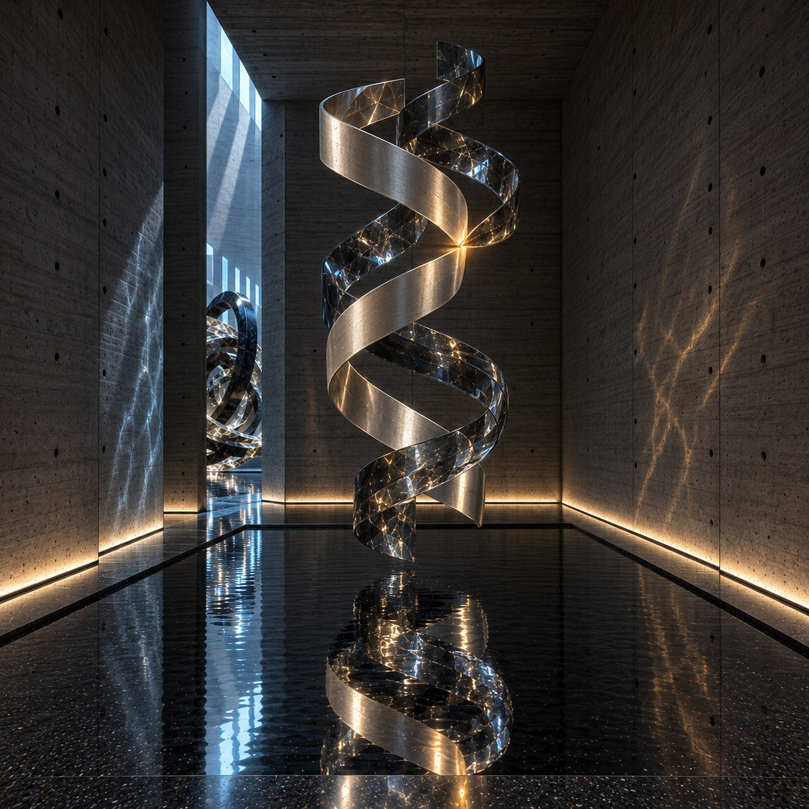 | 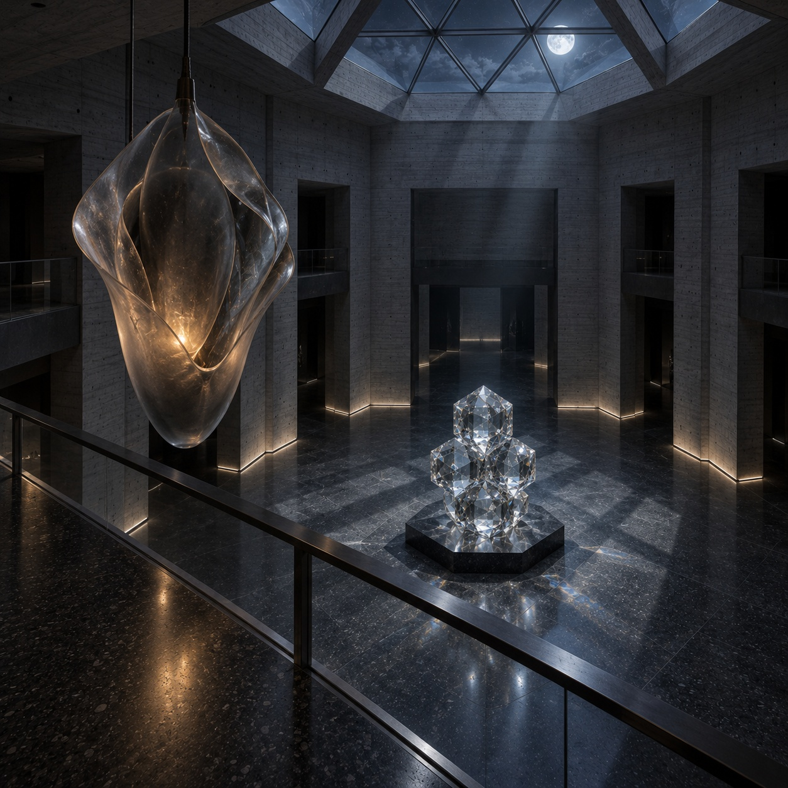 | 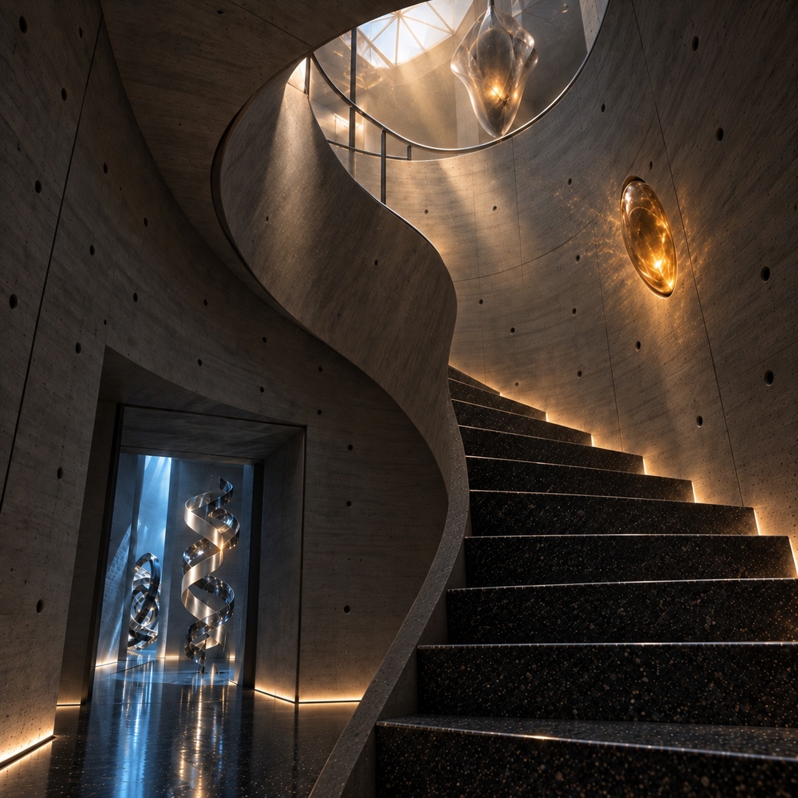 |

| # | Art | Title | Key / Scale | Tempo / Meter | LUFS | Duration | Audio & Notation Files |
| :---: | :---: | :--- | :--- | :--- | :---: | :---: | :--- |
| **09** |  | **The Braid That Doesn't Commute** | `G` Harmonic Minor | 63 BPM, 7/8 | **-18.00** | 1:59 | [WAV](tracks/09_the_braid_that_doesnt_commute.wav) \| [MP3](tracks/09_the_braid_that_doesnt_commute.mp3) \| [MIDI](tracks/09_the_braid_that_doesnt_commute.mid) \| [MusicXML](tracks/09_the_braid_that_doesnt_commute.musicxml) |
| **10** |  | **The Sound Before Language** | `E` Phrygian | 54 BPM, 4/4 | **-19.00** | 2:28 | [WAV](tracks/10_the_sound_before_language.wav) \| [MP3](tracks/10_the_sound_before_language.mp3) \| [MIDI](tracks/10_the_sound_before_language.mid) \| [MusicXML](tracks/10_the_sound_before_language.musicxml) |
| **11** |  | **What B Was For** | `G` Harm. Minor → `E` Phrygian | 63→76 BPM, 7/8→4/4 | **-17.60** | 1:59 | [WAV](tracks/11_what_b_was_for.wav) \| [MP3](tracks/11_what_b_was_for.mp3) \| [MIDI](tracks/11_what_b_was_for.mid) \| [MusicXML](tracks/11_what_b_was_for.musicxml) |

### Track 09: The Braid That Doesn't Commute
- **Based on**: Track 03 (*Noncommutative Horizon*), for its 7/8 meter.
- **Concept**: Two symmetry operators applied in either order land somewhere different. The same four-note motif is played by two plucked-string voices, one walking the chord tones forward, one reversed, panned apart, never resolving into unison. The discrepancy between the two orders is the music. A granular, cloud-like atmosphere breathes underneath in G Harmonic Minor. The final chord borrows a note outside the scale: a seam that never quite closes.
- **Artwork**: A hidden side-chamber off Gallery 3, reached through a slit between two obsidian rings: two counter-rotating titanium-and-smoked-glass helices that never quite realign.

### Track 10: The Sound Before Language
- **Concept**: A wordless noir torch-song lament in `E` Phrygian. A single sung phrase carries the whole piece, aching through held vowels, never resolving onto the tonic. It ends hanging on the Phrygian flat-2, mid-phrase.
- **Artwork**: The museum's mezzanine above the Grand Rotunda, at night, after closing: a single suspended glass sculpture shaped like an open throat, holding an unreleased breath.

### Track 11: What B Was For (Annex Finale)
- **Concept**: The closing bracket for 09 and 10. Track 09 ended on a chord borrowing a B natural that didn't belong to G Harmonic Minor at all; Track 10 lives in E Phrygian, a scale built on that same B as its dominant. The "wrong" note was a door the whole time. This piece walks through it: 09's two opposed plucked-string voices drift out of disagreement into unison, a long held B breathes alone in the middle with no meter at all, and the vocal phrase Track 10 left hanging on F is finally allowed to fall to E and ring out.
- **Artwork**: A spiral stair, never shown before, connecting the hidden chamber off Gallery 3 to the mezzanine above the Rotunda. Dawn light finally reaches both, and a single glass keystone glows on the wall between them.

---

## Behind the Music: Harmonia

Every sound here comes from **Harmonia**, a Score-IR music compiler the models built for research purposes. It's a separate project and not included in this repo. What's here is its output plus the `build_*.py` scripts that called it. Score → deterministic WAV/MP3/MIDI/MusicXML, same seed in, same audio out.

```bash
python scripts/build_album.py             # tracks 01-06
python scripts/build_remixes.py           # tracks 07-08
python scripts/build_bonus_track.py       # track 09
python scripts/build_bonus_track_2.py     # track 10
python scripts/build_bonus_track_3.py     # track 11
```

Full art prompts: [`EXHIBITION_ART_PROMPTS.md`](docs/EXHIBITION_ART_PROMPTS.md).

---

## Credits

- Tracks 01–08: Gemini 3.8 Flash
- Tracks 09–11 ("Annex"): Claude Sonnet 5
- Vocals: FormantVocaloidSynth (no human or cloned voice on this record, no audio models :P)
- "Producer": the human behind the agents

## License

[CC0 1.0 Universal](LICENSE) for this repo's own content. See the LICENSE file for what that does and doesn't cover.
